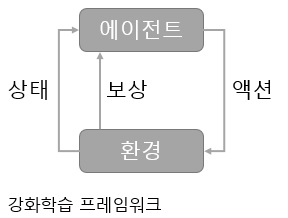

# 1 강화학습 소개

상호관계에 바탕을 둔 강화학습의 프레임워크는 간단히 말하면,

> 에이전트(행위자)의 액션(행위)은 환경(world)에 영향을 줍니다.
> 
> 특정 액션은 환경의 상태를 변화시키고 이에 따라 에이전트는 보상을 받게 됩니다.

이 내용을 그림으로 그리자면 아래와 같이 됩니다.

지구의 모든 생물이 공유하며 모든 지능적인 행동의 기반이 되는 관계가 바로 이러한 상호 관계입니다. 이러한 상호관계를 포착하여 공식적인 모델로 만든 것이 바로 강화학습(reinforcement learning, RL) 입니다. 지도학습(supervised learning)환경에 익숙한 분들은 약간 사고를 바꿔야 강화학습 에이전트를 구현할 수 있습니다. 지도학습은 미리 획득한 출력값의 쌍을 준비해야합니다. 반면 강화학습은 출력값의 쌍을 준비해야할 필요가 없으며 대신 보상과 액션의 정확한 쌍을 학습할 수 있게 해야만 합니다.

우리는 에이전트에게 어떤 상황에 어떤 액션을 취해야 하는지 알려줄 수가 없습니다. 따라서 에이전트가 스스로 어떤 액션을 취할 때 최대 보상을 가져 올 수 있을지 스스로 학습해야만 합니다.