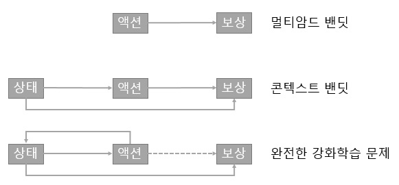

# 3 콘텐스트 밴딧

2장에서 구현한 밴딧문제 해결하는 에이전트를 구현하였습니다. 이 경우 환경은 상태를 가지지 않으며 단순히 최선의 액션을 선택하도록 학습하면 되었습니다. 여기에서는 상태가 주어지긴 하지만 이 상태가 이전 상태나 액션에 의해 결정되지 않는 문제의 해법에 대해 살펴보겠습니다. 지연된 보상은 다음 챕터에서 다룰 것입니다. 이 단순화 버전의 강화학습 문제를 콘텍스트 밴딧 이라고 합니다. 상태가 어떻게 액션과 보상에 영향을 주는지 그림으로 보겠습니다.

콘텍스트 밴딧에서는 **상태(state)** 라는 개념을 도입합니다. 상태는 환경에 대한 기술(description)로 이루어지며, 에이전트는 이를 이용해 좀 더 정보에 기반을 두고 액션을 취할 수 있습니다. 이제 문제는 1개의 밴딧이 아니라 여러 개의 밴딧으로 확장됩니다. 우리가 이문제를 해결하기 위해서는 멀티암드 밴딧 문제의 네트워크를 좀 더 확장해야 합니다.

[쥬피터 소스코드](https://github.com/awjuliani/DeepRL-Agents/blob/master/Contextual-Policy.ipynb)