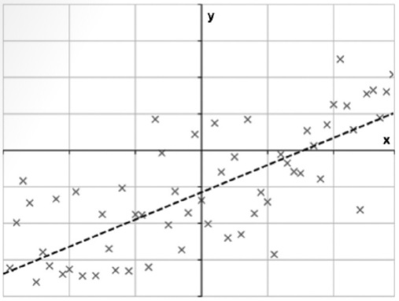

# 머신러닝의 주요 개념

머신러닝을 알기 위해서는 주요 4가지 개념을 이해해야 합니다.

* 모델 : 데이터를 바라보는 시점과 가정
* 손실함수 : 모델의 수식화된 학습 목표
* 최적화 : 손실함수로 표현된 모델을 실제로 학습
* 모델평가 : 모델의 성능이 실제 상황에서 어떨지 추정

## 2.1 모델 : 문제를 바라보는 관점

* 모델은 머신러닝의 시작이라고도 할 수 있습니다. 모델의 정의와 분류, 좋은 모델의 특징에 대해 알아보겠습니다.

### 2.1.1 모델이란

데이터를 갖고 문석을 할 때 패턴이 있다는 믿음을 갖고 시작하게 됩니다. 수학에서는 이것을 가정이라하며, 이런 여러가지 가정을 한데 모은 것을 머신러닝에서는 모델이라 합니다.

일반적으로 머신러닝의 과정은 아래와 같습니다.

`모델정하기 -> 모델 수식화하기 -> 모델 학습하기 -> 모델 평가하기 -> (필요에 따라 처음으로)`

과정1에서 가정을 다음과 같다고 합시다.

```이 데이터에서 x와 y는 선형적인 상관관계를 가진다. 즉, 임의의 w에 대해 y = wx와 같은 관계를 가질 것이다.```

그렇다면 과정3의 가정은 다음과 같을 수 있습니다.

```데이터를 토대로 추측한 결과 y = 2x와 같은 형태를 가진다. 그러므로 w는 2이다.```

모델을 3가지로 분류 해보겠습니다.

* 간단한 모델
* 복잡한 모델
* 구조가 있는 모델

좋은 모델이란 무엇인지, 그리고 좋은 모델을 얻기 위한 `편향-분산 트레이드오프`와 `정규화`에 대해서도 알아보겠습니다.

### 2.1.2 간단한 모델

모델이 간단하다는 것은 데이터가 간단하다는 뜻입니다. 가장 간단하시만 아주 효과적인 모델로는 `선형 모델`이 있습니다. `선형 회귀`는 대표적인 선형 모델입니다.

[선형회귀, 데이터(x)로 학습된 모델(점선), 수식은 y = -5+0.4x]



선형회귀 정의는 다음과 같습니다.

> 수식 : Y = W<sub>0</sub> + W<sub>1</sub>X<sub>1</sub> + W<sub>2</sub>X<sub>2</sub> + ...
>
> 출력값(Y)이 입력값(피처)(X<sub>1</sub>,X<sub>2</sub>, ...)에 대해 선형적인 관계

선형관계는 출력값이 입력값(피처값)들에 가중치를 곱한 값의 합(선형결합)으로 표현되는 관계입니다. 선형적인 관계는 예를 들자면 생산량(X)과 불량품 수(Y)를 들 수 있습니다. 생산량과 불량품 수는 일반적으로 양의 상관관계인 경우가 많으므로 선형 회귀 모델이 아주 적합니다.

간단한 모델의 특징

* 데이터가 복잡하지 않고 간단하게 생겼다고 가정
* 결과를 이해하기 쉬움
* 학습이 쉬움
* 가정 자체가 강력해서 모델의 표현능력에 제약이 많음

### 2.1.3 복잡한 모델

복잡한 모델은 데이터가 상대적으로 복잡하게 생겼다고 가정할 때 사용하는 모델입니다. 예를 들어 결정 트리 <sup>decision tree</sup> 모델을 들 수 있습니다.


결정 트리의 정의는 다음과 같습니다.

* 트리의 한 분기점 마다 한가지 조건(보통 입력의 한 부분)을 검사하여 분기를 합니다.
* 모든 분기가 끝나는 리프노드(맨 끝의 노드)에는 결괏값이 들어 있습니다.

결정 트리의 경우 각 데이터마다 식이 포함 될 수 있습니다. 그렇다 보니 전체 데이터에 대한 가정이 적어집니다. 그러나 이 것이 단점이 될 수 있습니다.

복잡한 모델의 특징

* 데이터가 어떻게 생겼을 것이라는 가정 자체가 별로 없습니다.
* 결과를 이해하기 어려울 수도 있습니다.
* 학습이 복잡합니다.
* 한정된 데이터에서만의 변화를 그대로 학습하므로 새로운 데이터에 대해 성능이 떨어질 수 있습니다.

### 2.1.4 구조가 있는 모델

구조가 있는 모델이 위 두가지(간단한 모델, 복잡한 모델)과 별개의 모델이 아니라 어느 항목에도 속할 수 있습니다. 다만, 몇 가지 특정 상황에서 요긴하게 쓰이는 모델이 있어 따로 설명 합니다. 구조가 있는 모델은 입력과 출력의 상관 관계를 학습할 뿐만 아니라 데이터 구조 자체를 모델링 하는 조금 특이한 모델입니다. 여기서는 순차 모델 <sup>sequence model</sup> 과 그래프 모델 <sup>graphical model</sup> 에 대해 다루겠습니다.

#### 2.1.4.1 순차 모델

순차 모델은 연속된 관측값이 서로 연관성이 있을 때 주로 사용합니다. 순차 모델의 대표적인 예는 아래 두가지 입니다.

* CRF <sup>conditional random field</sup>, (조건부 랜덤필드 또는 조건부 무작위장)
* RNN <sup>recurrent neural net</sup>, (순환신경망 또는 재귀신경망)

이들 모델의 특징은 특정 시점에서 상태를 저장하고 상태가 각 시점의 입력과 출력에 따라 변화한다는 점입니다.

RNN에 대해 알아봅시다.


RNN의 기본적인 정의는 아래와 같습니다.

* 수식: h<sub>t</sub> = w<sub>0</sub> + w<sub>1</sub>h<sub>t-1</sub> + 
w<sub>2</sub>x<sub>t</sub>
* 실제로 관측되지는 않았지만 특정 시점에 어떤 상태 h<sub>t</sub>가 존재한다고 가정합시다.
* 현재의 상태(h<sub>t</sub>)는 바로 직전의 상태(h<sub>t-1</sub>)와 현재의 입력 데이터 (x<sub>t</sub>)에 영향을 받습니다.
* 상태(h<sub>t</sub>)에 따라 출력(y<sub>t</sub>)이 결정됩니다.

RNN은 상탯값이 다른 모델과의 차이점 입니다.

#### 2.1.4.2 그래프 모델

그래프 모델은 그래프를 이용해서 순차 모델 보다 좀 더 복잡한 구조를 모델링 합니다. 예를 들면 문서의 문법구조를 직접 모델링하거나 이미지의 픽셀 사이의 관계를 네트워크로 보고 그래프로 표현하여 모델링 합니다. 대표적인 마르코프 랜덤 필드 <sup>markov random field</sup> (MRF)를 살펴보겠습니다.


그림에서 관측된 값(x)은 각 위치에서의 숨겨진 상태(h)에 의해 결정된다고 가정합니다.

* 데이터의 숨겨진 상태(h)사이에 어떤 연결구조가 있다고 가정한 후, 연결된 위치의 숨겨진 상태끼리는 연관성이 있다고 가정합니다.
* 보통 사진을 처리할 때 많이 사용하는데, 이런 경우에는 사진의 특정 위치의 상태(h)가 바로 근접한 위치의 상태들과 관계가 있다고 가정합니다.
* 그리고 실제로 관측된 값(x)은 상태에 따라 결정된다고 가정합니다.

### 2.1.5 좋은 모델이란 무엇인가

좋은 모델이란 `데이터의 패턴을 잘 학습한 모델` 이라고 할 수 있습니다. 모델을 평가하는 많은 이론이 있지만 그중 모델의 복잡도와 표현혁에 대한 균형을 다루는 `편향-분산 트레이드 오프 <sup>bias-variance trade-off</sup> 와 균형을 자동으로 학습하게 하는 정규화 <sup>regularization</sup> 에 대해 알아보겠습니다.

#### 2.1.5.1 편향-분산 트레이드오프

편향과 분산에 대해서는 [통계의 기초](https://github.com/swkwon/study/blob/master/math/통계의기초.md) 에서 설명을 하였습니다. 즉, 에러를 줄이기 위해서는 편향을 줄이거나 분산을 줄여야 합니다.


위 그림처럼 편향과 분산을 적당히 줄이면 어느정도 적당한 결과를 찾을 수 있게 됩니다. 편향이나 분산을 줄이는 대표적인 예로 다음과 같은 방법이 있습니다.

* 부스팅 <sup>boosting</sup> : 간단한 모델을 여러개 조합하여 편향을 줄이는 방법
* 랜덤 포레스트 <sup>random forest</sup> : 복잡한 모델인 결정 트리를 여러개 조합하여 분산을 줄이는 방법

#### 2.1.5.2 정규화

정규화는 정해진 모델이 필요 이상으로 복잡해지지 않도록 조절하는 트릭입니다. 모델이 데이터에 비해 필요 이상으로 복잡하면 불필요한 노이즈까지 학습해서 학습할 때는 성능이 좋지만, 실제로 사용할 때는 좋지 않은 성능을 보일 수 있습니다.모델의 복잡도를 줄이는 방법으로 크게 2가지가 있습니다.

* 모델 변경 : 데이터를 표현하는 방법을 완전히 새롭게 전환해서 적합한 모델을 찾는 방법(모델선택 방법은 `편향-분산 트레이드오프` 참조)
* 정규화 : 모델에 들어 있는 인자에 제한을 주어 모델이 필요 이상으로 복잡해지지 않게 하는 방법

구체적인 예를 들어 봅시다.


위의 그림처럼 선형 회귀를 한다고 생각합시다. 입력은 3개 x<sub>1</sub>, x<sub>2</sub>, x<sub>3</sub> 고 출력은 1개(y)라고 가정합시다. 이때 선형 회귀 모델은 다음과 같습니다.

> y = w<sub>0</sub> + w<sub>1</sub>x<sub>1</sub> + w<sub>2</sub>x<sub>2</sub> + w<sub>3</sub>x<sub>3</sub>

이 모델에서 2가지 입력을 무시하고 더 간단한 모델로 바꿔보겠습니다.

> y = w<sub>0</sub> + w<sub>1</sub>x<sub>1</sub>

또는 더 복잡한 연관 관계를 이용하는 모델을 다은과 같이 만들 수도 있습니다.

> y = w<sub>0</sub> + w<sub>1</sub>x<sub>1</sub> + w<sub>2</sub>x<sub>2</sub> + w<sub>3</sub>x<sub>3</sub> + w<sub>4</sub>x<sub>1</sub>x<sub>2</sub> + w<sub>5</sub>x<sub>2</sub>x<sub>3</sub> + w<sub>6</sub>x<sub>1</sub>x<sub>3</sub>

정규화 모델은 표현식에 추가적으로 제약 조건을 걸어서 모델이 필요 이상으로 복잡해지지 않도록 자동으로 조정해주는 기법입니다. 복잡한 식에 추가적인 제약 조건을 도입해서 필요 없는 인자들을 제거하게 됩니다.

> y = w<sub>0</sub> + w<sub>1</sub>x<sub>1</sub> + w<sub>2</sub>x<sub>2</sub> + w<sub>3</sub>x<sub>3</sub> (단, w<sub>1</sub>, w<sub>2</sub>, w<sub>3</sub>중에 두개만 0이 아닌 값을 가진다)

이렇게 되면 위 식은 3가지 식으로 표현할 수 있습니다.

> y = w<sub>0</sub> + w<sub>1</sub>x<sub>1</sub> + w<sub>2</sub>x<sub>2</sub>
>
> y = w<sub>0</sub> + w<sub>2</sub>x<sub>2</sub> + w<sub>3</sub>x<sub>3</sub>
>
> y = w<sub>0</sub> + w<sub>1</sub>x<sub>1</sub> + w<sub>3</sub>x<sub>3</sub>

이렇게 되면 모델은 위 3가지 식중 가장 적합한 하나를 자동으로 찾아줍니다.

## 2.2 손실함수 : 모델의 수식화된 학습목표

손실함수 <sup>loss function</sup> : 모델이 실제 데이터를 바르게 표현했는지 혹은 얼마나 예측이 정확한지 평가하는 함수

손실함수로 얻은 결괏값은 `에러`라고 부르며 작을 수록 모델이 정확하게 학습된 것입니다.

손실함수는 데이터 전체에 대해 계산하는 함수지만, 간단하게 표시하기 위해 한 개의 데이터에 대해서만 정의하기도 합니다. 이때 각 데이터에 대한 손실함수 계산 결과의 총합이 그 모델과 데이터 전체에 대한 손실함수 결과 입니다. 이런 경우에는 몇가지 가정이 추가됩니다. 예를 들어 데이터셋에서 각각의 데이터가 서로 확률적 독립이고 같은 분포를 가진다는 i.i.d 가정(독립항등분포)이 대표적입니다.

* 산술 손실함수 : 모델로 산술값을 예측할 때 데이터에 대한 예측값과 실제 관측값을 비교하는 함수 입니다. 주로 회귀 문제에서 사용합니다.
* 확률 손실함수 : 모델로 항목이나 값에 대한 확률을 예측하는 경우에 사용합니다. 매우 유연하기 때문에 회귀 문제를 비롯해 보편적으로 사용합니다.
* 랭킹 손실함수 : 모델로 순서를 결정할 때 사용합니다. 추천 시스템에 주로 사용합니다.
* 모델 복잡도와 관련된 손실함수 : 보통 위 손실함수들과 합쳐져서 모델이 필요 이상으로 복잡해지지 않도록 방지하는 손실함수 입니다. 앞에서 설명한 정규화의 일종입니다.

우리는 위 4가지 손실함수에 대해 다룰 것입니다.

### 2.2.1 산술 손실함수

모델로 산술값을 예측할 때 각 데이터에 대한 예측값과 실제 관측값의 차이를 산술적으로 계산하는 손실 함수를 많이 사용합니다. 차이의 제곱을 사용하는 `제곱 손실함수`와 차이의 절댓값을 사용하는 `손실함수`가 많이 쓰입니다.

제곱 손실함수를 쓰는 이유를 간단하게 설명하자면 주어진 데이터 출력값(y)과 모델의 예측값 (ŷ) 의 차이의 제곱을 계산하므로, 최적화가 쉽고, 손실값의 이해가 쉽기 때문입니다. 제곱 손실함수는 다음과 같습니다.

loss(f) = (y - ŷ)<sup>2</sup>

f : 모델
y : 데이터로부터 주어진 출력
ŷ : 모델에 데이터로부터 주어진 입력을 넣어서 계산한 값

예를들어 어떤 선형 모델을 가정할 때, 입력값 x가 모델의 추정치 ŷ와 다음과 같은 관계를 가집니다.

> 선형모델 f : x -> ŷ = w<sub>0</sub> + w<sub>1</sub>x

이 경우 제곱 손실함수는 아래와 같이 정의 할 수 있습니다.

> 선형모델 loss(f) = (y - w<sub>0</sub> - w<sub>1</sub>x)<sup>2</sup>

위 예는 입력 x와 출력 y인 데이터 1개에 대해 학습된 모델이 얼마만큼의 에러를 가지는지, 즉 얼마나 데이터를 잘 표현하는지 정량적으로 계산합니다. 전체 데이터에 대해서는 모든 손실함수의 값을 합산하거나 평균 값을 사용합니다. 평균의 경우 `평균 제곱 편차`라는 표현을 주로 사용합니다.

예를 들어 보겠습니다.

x = 1, y = 3 일 때 손실함수를 계한하겠습니다. 일단 학습을 하기전 w<sub>0</sub>과 w<sub>1</sub>을 0으로 초기화 합니다.

> (3 - 0 - 0 x 1)<sup>2</sup> = 9

여기서는 설명하지 않았지만 우연히 w<sub>1</sub> = 2 일 때 더 좋을 것이라 추측했다고 합시다. 그 경우 손실함수는 다음과 같이 계산 됩니다.

> (3 - 0 - 2 x 1)<sup>2</sup> = 1

w<sub>0</sub>과 w<sub>1</sub>이 0 일 때 보다 더 작은 값이 나왔습니다. 더 작은 에러가 나왔다는 것은 더 정확하게 학습된 모델이라는 뜻입니다. 만일 w<sub>0</sub> = 1을 넣으면 에러는 0이 되고 해당 데이터에 대해 완벽한 모델이 됩니다. (그렇지만 실제로는 발생하기 힘듭니다.)

### 2.2.2 확률 손실함수

위의 산술 손실함수는 산술값을 예측하기 위한 회귀 모델에 적합합니다. 확률 손실함수는 특정항목을 고르는 분류모델에 더 적합합니다.

여기서는 확률 손실함수 중 자주 사용되는 교차 엔트로피 <sup>cross entropy</sup> 함수에 대해 알아봅니다. 이 함수는 특히 딥러닝에서 많이 사용합니다. 이 함수는 MLE <sup>maximum likelihood estimation</sup> (최대 가능도 방법) 방식에 따라 만들어 집니다. 여기서 가능도 <sup>likelihood</sup> (혹은 우도)란 주어진 데이터가 가정한 모델에 얼마나 적합한지에 대한 조건부 확률 입니다. 수식은 p(x|f)와 같이 씁니다. 여기서 x는 데이터, f는 모델입니다. 가능도가 커질 수록 주어진 모델이 관측된 데이터를 더 잘 표현한 것이 됩니다. 보통 손실함수는 최소값을 구하는 최적화 방식을 사용합니다. 그래서 계산 편의를 위해 가능도의 부호를 바꾸고 log값을 취한 음의 로그 가능도 <sup> negative log-likelihood</sup> 손실함수를 많이 사용합니다.

> loss(f) = -log p(x|f)

우리는 여기서 분류에서 많이 사용되는 다항 로지스틱 회위 <sup>multinomial logistic regression</sup> 의 음의 로그 가능도 손실함수에 대해 살펴보겠습니다.

다항 로지스틱 회귀는 입력값을 {1, 2, 3, ... C} 중 하나로 분류합니다. 이때 모델의 각 항의 예측값은 0부터 1 사이의 실수가 되고 모든 항의 예측값의 총합은 1이 됩니다. 각 분류에 대한 확률을 ŷ<sub>i</sub> 할때 식은 아래와 같습니다.


출력 y중 정답인 i번째 항목에 대해 예측한 확률 (ŷ<sub>i</sub>)에 -log를 씌운 값이 바로 해당 데이터의 손실함수 값입니다.

확률 손실함수의 식은 복잡해 보이지만 실제 의미는 아주 간단합니다. 정답을 맞힐 확률을 최대화 하는 겁니다. 많은 문제(분류, 회귀 등)를 확률을 이용해서 풀 수 있는데 그중에서도 확률 손실함수는 산술 손실함수와 더불어 가장 대표적입니다.

### 2.2.3 랭킹 손실함수

랭킹 손실함수는 모델이 예측해낸 결괏값의 순서가 맞는지 판별합니다. 랭킹 손실함수는 목록에서 몇가지를 추천하는 추천 시스템이나 랭킹학습 분야에서 많이 사용합니다. 데이터의 순서가 아래와 같다고 할때,

> x<sub>1</sub> > x<sub>2</sub> > x<sub>3</sub> > x<sub>4</sub> > x<sub>5</sub>

모델은 각 데이터의 순서를 x의 의미에 따라 학습합니다. x는 숫자를 의미한다기보다는 개념이라고 생각하면 됩니다.

모델이 만들어낸 순서 목록에서 모든 쌍의 순서가 맞았는지 틀렸는지 확인하는 방식이 가장 간단합니다. 예를들어 모델이,

> x<sub>3</sub> > x<sub>1</sub> > x<sub>2</sub> > x<sub>4</sub> > x<sub>5</sub>

라는 결과를 만들었다면 각 쌍에 대해 다음과 같은 결괏값 쌍을 가집니다.

* x<sub>3</sub> > x<sub>1</sub>
* x<sub>3</sub> > x<sub>2</sub>
* x<sub>3</sub> > x<sub>4</sub>
* x<sub>3</sub> > x<sub>5</sub>
* x<sub>1</sub> > x<sub>3</sub>
* x<sub>1</sub> > x<sub>4</sub>
* x<sub>1</sub> > x<sub>5</sub>
* x<sub>3</sub> > x<sub>4</sub>
* x<sub>3</sub> > x<sub>5</sub>
* x<sub>4</sub> > x<sub>5</sub>

이 모델의 결괏값 쌍과 정답인 x<sub>1</sub> > x<sub>2</sub> > x<sub>3</sub> > x<sub>4</sub> > x<sub>5</sub> 를 비교하면 10가지 관계 중에서 2가지의 관계 (x<sub>3</sub> > x<sub>1</sub>, x<sub>3</sub> > x<sub>2</sub>)가 잘못되었으므로 손실함수 결과는 2입니다. 이 손실함수는 페어와이즈 제로-원 손실함수<sup> pairwise zero-one loss </sup> 라고 부릅니다.

다른 방식으로 손실을 측정하는 편집거리 <sup>edit distance</sup> 라는 랭킹 손실함수도 있습니다. 이 손실함수는 모델이 예측한 순서 목록에서 몇번의 맞바꿈을 해야 원래 순서로 돌아갈 수 있는지 측정합니다. 모델이 만들어낸 순서목록에서 x<sub>3</sub>을 우로 두번 이동하면 맞는 순서가 됩니다. 편집 거리 손실함수의 결과 역시 2로 나옵니다. 그러나 여기서 설명한 손실함수의 결과가 항상 동일하게 나오는 것은 아닙니다.

### 2.2.4 모델 복잡도와 관련된 손실함수

 손실함수를 이용해 제약 조건을 걸어 정규화 효과를 낼 수 있습니다. 즉, 손실함수를 이용하여 모델 복잡도를 조절할 수 있습니다.

 보통 모델복잡도에 대한 손실함수를 따로 사용하지 않고 앞에서 배운 3개(산술, 확률, 랭킹 손실함수)를 조합하여 사용합니다. 예를들어 입력이 3개인 손실함수를 생각해봅시다.

 > loss(f) = (y - ŷ)<sup>2</sup>
 >
 > ŷ = f(x) = w<sub>0</sub> + w<sub>1</sub>x<sub>1</sub> + w<sub>2</sub>x<sub>2</sub> +  w<sub>3</sub>x<sub>3</sub>

 만약 x<sub>1</sub>, x<sub>2</sub>, x<sub>3</sub>중 출력 (y)에 영향이 별로 없는 값이 있다면 제대로 학습되지 않을 수도 있습니다. 만일 셋중 두개만 의미가 있다면 하나는 항상 0이 되어야 한다고 제약을 걸 수 있지만 이런 제약조건은 직접적으로 사용하면 수학적으로 학습하기가 복잡하기 때문에 최적화 하기 쉬운 제약을 아래 처럼 정하게 됩니다.
 
> |w<sub>1</sub>| + |w<sub>2</sub>| + |w<sub>3</sub>| 를 너무 크게 만들지는 말자 (L1 정규화 손실함수)
> 
> w<sub>1</sub><sup>2</sup> + w<sub>2</sub><sup>2</sup> + w<sub>3</sub><sup>2</sup> 을 너무 크게 만들지는 말자 (L2 정규화 손실함수)

너무 크게 만들지 말자라는 뜻은 0에서 너무 많이 멀어지지 말자라는 뜻입니다. 0에서 멀어지면 손실이 커지기 때문입니다.

## 2.3 최적화 : 실제로 학습을 하는 방법

이제 손실함수를 이용해서 모델을 학습하는 방법에 대해 알아보겠습니다. 손실함수의 결괏값을 최소화하는 모델의 인자(보통 `θ`로 표기)를 찾는 것을 최적화라고 합니다.

2차 방정식을 따르는 손실함수(loss = (θ-2)<sup>2</sup> + 1)


위 그림에서 θ = 2일때 손실이 최소 입니다.  그러나 이 것처럼 한번에 풀리는 경우는 많지 않고 여러번 반복해서 업데이트를 해야 최솟값을 찾을 수 있습니다. 이 최솟값을 찾을 수 있는 방법이 몇가지 있습니다.

* 경사하강법<sup>gradient descent</sup>
* 뉴턴/준뉴턴 방법<sup>newton/quasi-newton method</sup>
* 확률적 경사하강법<sup>stochastic gradient descent</sup>
* 역전파<sup>backpropagation</sup>
* 그 외...

### 2.3.1 경사하강법

경사하강법은 간단한 최적화 방법중 하나로 임의의 지점에서 시작하여 더이상 내려갈 수 없을 때까지 반복적으로 내려가 최적화를 수행합니다.


