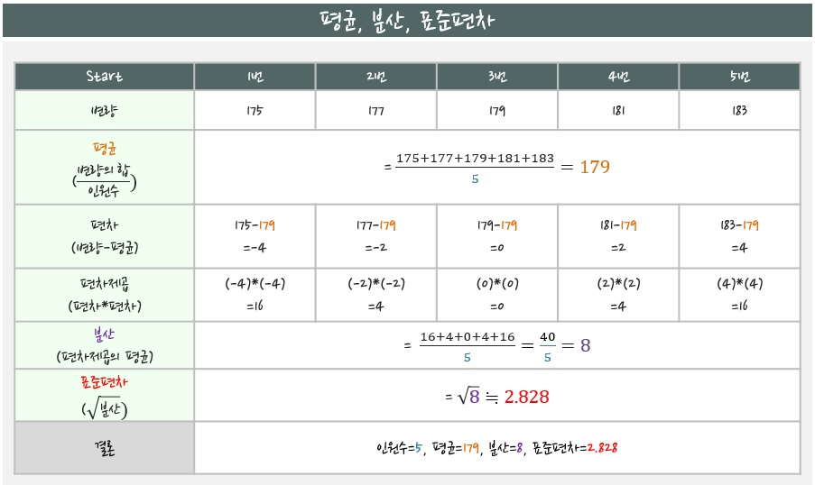
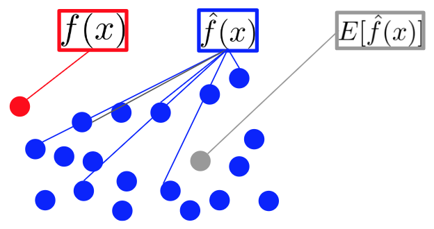
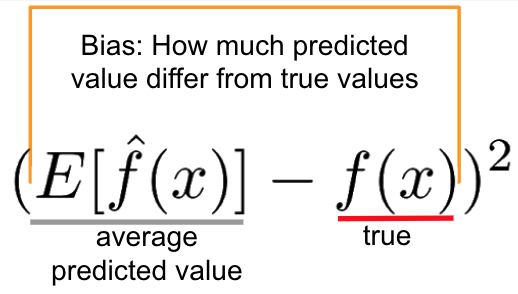
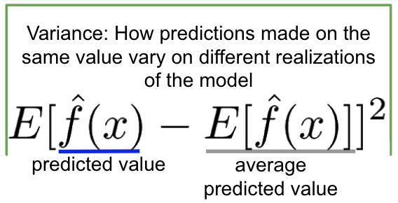
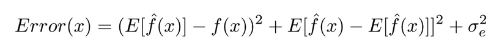
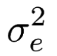

# 통계의 기초

## 평균, 편차, 분산, 표준편차

아래 그림은 1번 부터 5번까지 키의 값 입니다.

* 변량 : 관측값
* 평균 : 변량의 합 / 갯수
* 편차 : 변량 - 평균
* 편차제곱 : 편차 * 편차
* 분산 : 편차제곱 합 / 갯수
* 표준편차 : 분산의 제곱근

> 표준편차는 평균의 함정을 피할 수 있습니다.
>
> 편차제곱을 하는 이유는 편차는 음수가 될 수 있기 때문에 제곱을 해줍니다.
>
> 분산을 제곱근 하는 이유는 편차제곱을 하여 값이 너무 커졌기 때문입니다.

## 편향과 분산

예측값들과 정답이 대체로 멀리 떨어져 있으면 `편향(bias)`이 높다고 말하고, 예측값들이 자기들끼리 멀리 흩어져 있으면 `분산(variance)`이 높다고 말합니다.

* x는 데이터를 의미 합니다.
* f(x)는 데이터가 향해야 하는 정답을 의미 합니다.
* f(x)위의 ^ 표시가 있는 것을 f hat x 라고 읽습니다. 여기서는 컴퓨터가 내놓은 예측값들 입니다.
* E[]는 기댓값인데 쉬운말로 평균입니다. 즉, f hat x의 평균값 입니다.

### 편향의 수식

위의 그림에서 편향은 빨간점과 회색점의 관계입니다. 즉, 예측값이 정답에서 (차이가 있는가, 얼마나 떨어져 있는가)를 표현합니다. 편향의 수식은 아래처럼 예측값 평균과 정답값을 빼준 것 입니다.

### 분산의 수식

분산은 처음 그림처럼 편차제곱의 평균이니 아래와 같은 수식이 됩니다.

편향과 분산을 더해서 전체적인 경향을 표현합니다.

위 식은 파란점 하나(예측값)를 x로 보고 표현한 식입니다. 예측을 한번 했을 때 오차(Error)를 나타냅니다.

아래 기호는 irreducible error 즉, 무슨짓을 해도 줄일 수 없는 근본적인 오차를 의미합니다. 실제로 계산할 수 있는 값은 아니고 의미적으로 이해하면 됩니다.

