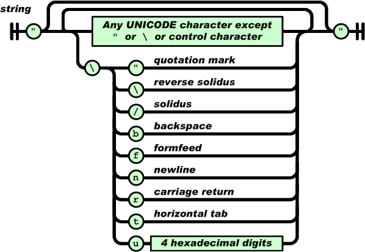

# JSON

## 1. JSON 개요

JSON은 경량의 DATA-교환 형식입니다. 이 형식은 사람이 읽고 쓰기에 용이하며, 기계가 분석하고 생성함에도 용이합니다.

## 2. JSON의 구조

JSON은 name/value의 object 형식과 array와 같은 형식 두가지 형식이 있습니다.

## 3. object 형식

object는 name/value 쌍들의 비순서화된 SET이다. object는 `{`(좌 중괄호)로 시작하고 `}`(우 중괄호)로 끝내어 표현한다. 각 name 뒤에는 `:`(colon)을 붙이고, `,`(comma)로 name/value 쌍들간을 구분한다.


## 4. array 형식

array는 값들의 순서화된 collection 이다. array는 `[`(좌 bracket)로 시작해서 `]`(우 bracket)로 끝내어 표현한다. `,`(comma)로 array의 값들을 구분한다.


## 5. name

name은 항상 string 형식이다.

## 6. value

value는 7가지의 타입이 들어갈 수 있다.

1. string
2. number
3. object
4. array
5. *true*
6. *false*
7. *null*


## 7. string

string은 큰따옴표안에 둘러 싸인 zero 이상 unicode문자들의 조합이다. 쌍따옴표안에 감싸지며, backslash escape가 적용된다. 하나의 문자도 하나의 문자열로 표현된다.



## 8. number

number는 8진수와 16진수 형식을 사용하지 않는 것을 제외하면 일반적인 언어와 많이 비슷하다.


## 9. JSON 구조 예제

```json
{
    "name":"swkwon",
    "age":38,
    "male":true,
    "hobby":["watching TV", "playing game"],
    "favorite_game": [
        {
            "title":"overwatch",
            "developer":"blizzard"
        },
        {
            "title":"titanfall2",
            "developer":"respawn"
        }
    ]
}
```