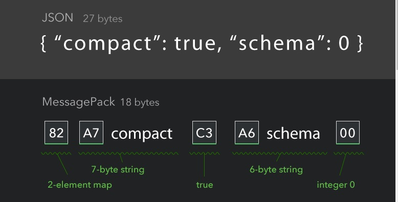

# MessagePack

## 1. 개요

MessagePack은 효율적인 바이너리 직렬화 포맷입니다. JSON과 같이 여러 언어에서 데이터를 교환할 수 있습니다. 그러나 JSON보다 경량화 되어 있고, 더 빠릅니다.

---

## 2. 직렬화된 구조의 예



---

## 3. release

MessagePack은 언어별로 github page가 분산 되어 있습니다. [www.msgpack.org](www.msgpack.org) 에서 언어 메뉴를 클릭하면 API 예제 상단에 라이브러리 링크가 있습니다.

---

## 4. 장점

1. schema free 구조라 유연한 개발이 가능합니다.
2. JSON 보다는 빠릅니다.
3. C++의 경우 Header only library라 라이브러리 빌드가 필요 없습니다.
4. 같은 언어라도 여러가지 라이브러리가 있습니다.
5. 사용하기가 편합니다. (protobuf나 flatbuffers 보다 더)
6. 약 50여개의 프로그래밍 언어의 라이브러리가 있습니다.(몇몇언어 에서는 JSON과 호환이 쉽다.)

---

## 5. 단점

1. schema free 구조라 msg 구조에 대해 문서화가 중요합니다.
2. protobuf 보다는 느립니다.(그러나 메모리 효율은 좋습니다.)

---

## 6. Tutorial

C++에서 직렬화 하고 Go에서 역직렬화 하는 코드를 작성해보겠습니다.

```Cpp
class Option {
public:
  Option() {}
  Option(const char* ab)
    : ability(ab) {}

private:
  std::string ability;
public:
  MSGPACK_DEFINE(ability);
};

class Item {
public:
  Item() {}
  Item(const int64_t idx, const char* n, const Option& op)
    : index(idx), name(n), option(op) {}
private:
  int64_t index;
  std::string name;
  Option option;
public:
  MSGPACK_DEFINE(index, name, option);
};

class Inventory {
public:
  Inventory() {}
  void AddItem(const int64_t i, const Item& it) {
    inv[i] = it;
  }
private:
  std::map<int64_t, Item> inv;
public:
  MSGPACK_DEFINE(inv);
};
```

Inventory 클래스는 복잡한 구조로 이루어져 있습니다. Inventory class에서 msgpack 라이브러리가 직렬화할 멤버를 알 수있도록 `MSGPACK_DEFINE(inv);` 라고 표시해 줍니다.
Item class도 마찬가지, Option class 도 마찬가지 입니다. 직렬화 방법은 아래와 같습니다.

```cpp
  Option damage("damage");
  Option critical("critical");
  
  Item damage_item(1, "damage_potion", damage);
  Item critical_item(2, "critical_potion", critical);
  
  Inventory inv;
  inv.AddItem(1, damage_item);
  inv.AddItem(2, critical_item);

  std::stringstream ss;
  msgpack::pack(ss, inv);
```

Inventory 데이터를 만들고, std::stringstream 객체에 inv의 직렬화 데이터를 담습니다. 이 바이너리 

스키마가 없다보니 각 앱 마다 메시지 구조를 알아서 잘 만들어 주어야 합니다.

```go
type Inventory struct {
  Inv map[int64]GameItem
}

type GameItem struct {
  Index      int64
  Name       string
  ItemOption Option
}

type Option struct {
  Ability string
}
```